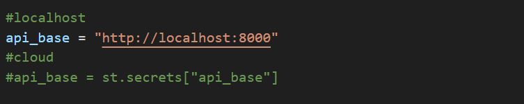
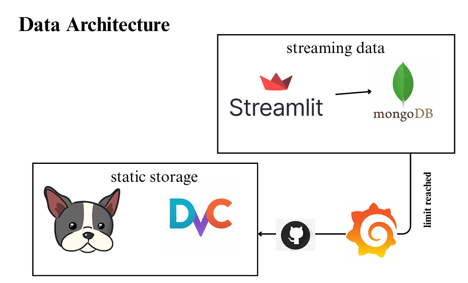
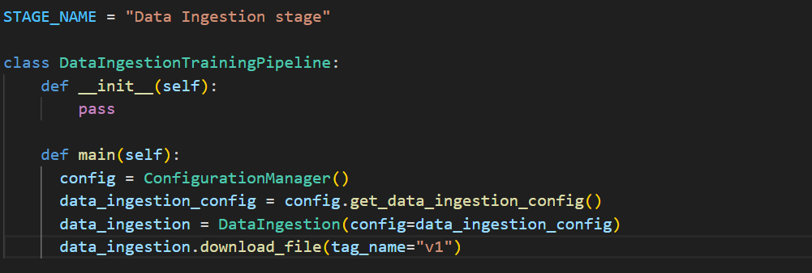

# BARKALYZE

“This isn’t just code it’s a reflection of what should be taught before frameworks, tools, or AI.”
---

  
  
  

---

## 🚀 Built with the Tools & Technologies

  <!-- Row 1 -->
  
  
  
  
  
  
  
  

   

  <!-- Row 2 -->
  
  
  
  
  
  
  

---

## 📘 Project Overview

At the heart of Barkalyze lies a different kind of purpose:
Not to chase flashy utility or jump on the latest AI bandwagon
, but to master the craft of building intelligent systems the right way.

We’re not here to vibe code.
We’re here to engineer.

In today’s Gen-Z coding culture, most student projects revolve around copying snippets from AI tools, wiring things up with minimal understanding, and celebrating half-working demos. What’s lost in the process? The fundamentals: architecture, clarity, reproducibility, maintainability.

Barkalyze is our counter-response to that trend a fully-engineered AI system not built to impress, but to inspire better practice.
It’s not about what it does. It’s about how beautifully and thoughtfully it’s done.

🎯 What This Project Stands For
"Student projects should be playgrounds for architecture, experimentation, and engineering hygiene not just shipping features."

✅ PEP8-compliant, modular, and human-readable code

✅ Clearly defined function contracts, with purpose and documentation

✅ Structured architecture: separation of concerns across components

✅ Dockerized & environment-driven setup

✅ Pipeline automation, not manual workflows

✅ Version-controlled everything: code, data, models

✅ MLflow & DVC for reproducibility and traceability

✅ Monitoring-first mindset with Prometheus + Grafana dashboards

✅ Beautifully declarative configs (YAML/JSON) for predictable environments

✅ No magic, no guesswork just clean systems thinking

---

# ⚙️ Environment Setup

This project was built with Python 3.11.4, and every component is configured for easy local or containerized deployment. Follow the steps below to get everything running cleanly.

📁 1. Clone the Repository

git clone https://github.com/Saivamshi-git/barkalyze.git

cd barkalyze

Make sure you're using Python 3.11.4 if running manually.
---

📄 2. Install Python Dependencies (for local development)
If you want to run components manually (e.g., Streamlit), set up a virtual environment:

python3.11 -m venv barkenv

source barkenv/bin/activate  # On Windows: barkenv\Scripts\activate

pip install -r requirements.txt
---
📦 3. Backend Setup using Docker Compose

The backend is fully containerized using Docker Compose, which automatically sets up:

🚀 FastAPI app (model inference + metrics)

📊 Prometheus (metrics collection)

📈 Grafana (real-time dashboard)

🔐 Configure Your .env File First

Before running Docker Compose, create a .env file in the root directory with the following:

MONGODB_URI = mongodb://<your_mongodb_url>

REPO_OWNER = <your_dagshub_username>

REPO_NAME = <your_repo_name>
---
🐳 4. Start the Backend Stack

Once your .env is ready, run:

docker-compose up --build

This will launch:

Service	URL

FastAPI	http://localhost:8000/metrics

Prometheus	http://localhost:9090

Grafana	http://localhost:3000
---
🖥 5. Streamlit Frontend Setup

You can run the Streamlit app independently from the /frontend directory:

in Frontend/app.py (make changes this way)

then run

cd Frontend

streamlit run app.py

---

# Pipeline Workflows
1. Update config.yaml
2. Update secrets.yaml [Optional]
3. Update params.yaml
4. Update the entity
5. Update the configuration manager in src config
6. Update the components
7. Update the pipeline
8. Update the main.py
9. Update the dvc.yaml

🔁 DVC Workflow: Step-by-Step to get your pipeline work

🧱 1. Initialize DVC (only once)

dvc init

2. make the pipeline run to create a lock file

set PYTHONPATH=.

dvc repro

🧠 3. Visualize the Pipeline

dvc dag

🔁 Data Workflow: Step-by-Step to versioning the updated dataset

🔹 Step 1: Clean and Prepare the Dataset

python data_versioning/cleaning_data.py

🔹 Step 2: Add the Dataset to DVC

dvc add data_versioning/emotion_dataset

🔹 Step 3: Commit the DVC Metadata to Git

git add data_versioning/emotion_dataset.dvc .gitignore

git commit -m "Add emotion dataset version 2"

🔹 Step 4: Tag the Dataset Version

git tag v2

git push origin v2

The current data will be uploaded in the storage of dagshub and you can use it based on the version

Make changes in the pipeline to get the current version dataset

in src\bark\pipeline\stage_01_dataingestion.py

---

### Optional things

uvicorn connect.api:app

docker-compose down --volumes

docker-compose up --build

### cleaning dataset

dvc remove artifacts/data_ingestion/emotion_dataset.dvc

dvc gc -w --force

git add .

git commit -m "Remove old dataset for reset"

git push origin main

